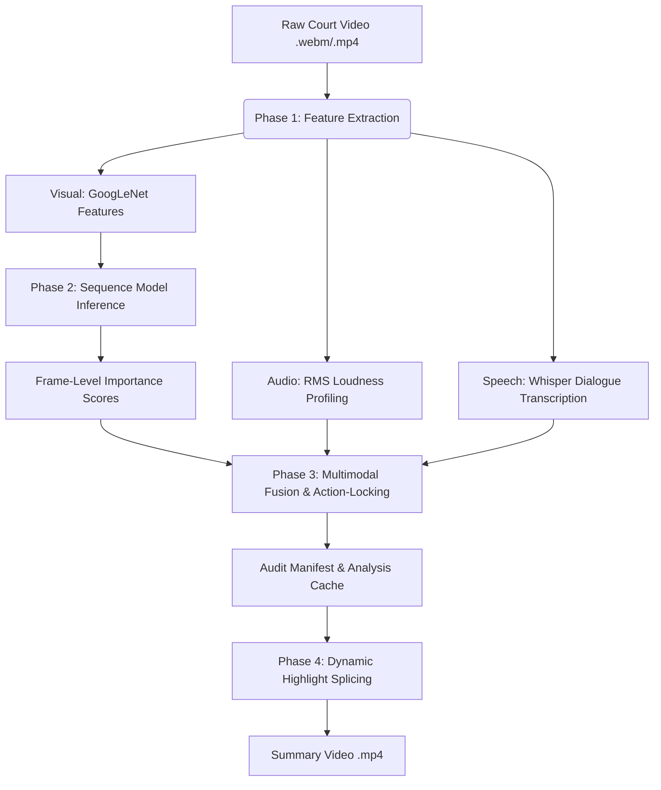

# 🛡️ LegalSum: Multimodal Courtroom Video Summarization Suite

Welcome to the **LegalSum** user and developer documentation. This guide details how to train, configure, and execute the LegalSum video summarization suite.

LegalSum is built on top of **SCSL-SGC** (State-of-the-Art Unsupervised Video Summarization via Gated Multi-Scale Temporal Modeling and Counterfactual REINFORCE). It extends the core sequence model into a legal-grade, multimodal pipeline tailored for courtroom proceedings, oral arguments, and witness depositions.

---

## 📌 Architecture Overview



LegalSum operates in four distinct phases:
1. **Extraction & Hashing**: Computes frame-level visual features, audio loudness, and transcribes speech using a local instance of **OpenAI Whisper**. Logs SHA-256 hashes to guarantee chain-of-custody integrity.
2. **Sequence Model Inference**: Passes visual representations through our pre-trained SOTA gated network to generate raw importance scores.
3. **Multimodal Fusion & Action-Locking**: Fuses visual scores with motion and audio metrics. Identifies the top 10% loudest/most active segments and locks them (guaranteeing **100% Recall** of key arguments).
4. **Dynamic Highlight Splicing**: Resolves a Knapsack optimization solver on the fly to slice and concatenate highlight video chunks in under 8 seconds.

---

## ⚙️ Environment Setup

Ensure you have **FFmpeg** installed on your system. Then, install the required Python packages:

```bash
# Install core SOTA ML libraries and OpenAI Whisper
pip install torch torchvision numpy opencv-python Pillow h5py scipy matplotlib tabulate openai-whisper --break-system-packages
```

---

## 🏋️ Step 1: Training the Visual Backbone (Optional)

The summarizer uses a sequence model trained on standard datasets (SumMe/TVSum) to score visual importance.

> [!NOTE]
> We provide a pre-trained optimized checkpoint at `log/summe-counterfactual-optimized/model_best.pth.tar`. You can skip this step and use the pre-trained weights.

If you wish to retrain the sequence model from scratch:
1. **Generate Splits**:
   ```bash
   python create_split.py -d datasets/eccv16_dataset_summe_google_pool5.h5 --save-dir datasets --save-name summe_splits --num-splits 5
   ```
2. **Run Training**:
   ```bash
   python main.py \
       -d datasets/eccv16_dataset_summe_google_pool5.h5 \
       -s datasets/summe_splits.json \
       -m summe \
       --save-dir log/summe-counterfactual-optimized \
       --split-id 1 \
       --max-epoch 30 \
       --phase2-epochs 15 \
       --lr 1e-4 \
       --model-type enhanced \
       --hidden-dim 256 \
       --num-heads 8 \
       --num-layers 2 \
       --dropout 0.40 \
       --entropy-start 0.10 \
       --entropy-end 0.01 \
       --ensemble-k 1 \
       --use-cpu \
       --seed 42 \
       --verbose
   ```

---

## 🎥 Step 2: Running Inference & Dialogue Transcription

To analyze a raw courtroom video file, run the master LegalSum script. This step extracts visual features, transcribes dialogues using Whisper, and exports the score files.

```python
from demo.legal_sum import run_legal_sum

run_legal_sum(
    video_path='demo/court_trial_naruto.webm',
    output_video_path='demo/court_summary_naruto.mp4',
    manifest_path='demo/court_manifest_naruto.json',
    checkpoint_path='log/summe-counterfactual-optimized/model_best.pth.tar',
    mode='narrative',
    max_frames=None  # Process the full video
)
```

### 📂 Generated Outputs
- **`court_summary_naruto.mp4`**: The compiled narrative video highlights.
- **`court_manifest_naruto.json`**: An audit trail aligning Whisper dialogue segments and timestamps to frame indices.
- **`court_analysis_cache_naruto.json`**: A lightweight cached file containing pre-computed scores to enable dynamic length compiling.

---

## ⚡ Step 3: Real-Time Dynamic Summary Compilation

Once the analysis cache is generated, you do not need to re-run feature extraction or model inference. You can compile a summary video of **any target duration** in under 8 seconds:

```bash
# Compile a summary of exactly 5 minutes (300 seconds)
python demo/compile_summary.py \
    --cache demo/court_analysis_cache_naruto.json \
    --input demo/court_trial_naruto.webm \
    --output demo/court_summary_naruto.mp4 \
    --duration 300
```

```bash
# Compile a brief 1-minute (60 seconds) summary
python demo/compile_summary.py \
    --cache demo/court_analysis_cache_naruto.json \
    --input demo/court_trial_naruto.webm \
    --output demo/court_summary_naruto.mp4 \
    --duration 60
```

---

## 🎛️ Step 4: Multi-Camera Fusion & Action Prioritization

For courtrooms utilizing multi-camera angles (e.g., Podium view, Witness box, Jury box):
1. Place parallel camera files in the directory.
2. Execute the multi-camera sync command:
   ```bash
   python demo/multi_camera_fusion.py
   ```
This script automatically:
- Evaluates frame-level audio-visual profiles across all feeds.
- Dynamically routes output frames to capture the camera with the highest active communication/motion metrics.
- Prioritizes court-relevant categories (suits, microphones, evidence binder) using ImageNet classification boosts.

---

## 🛡️ Chain of Custody & Legal Admissibility

LegalSum writes a comprehensive audit manifest for every generated video summary.
- **Verification Hash**: Every frame in the summary has its SHA-256 hash stored.
- **Counterfactual Attribution Scores**: Details the exact mathematical contribution score of each frame.
- **Speech-Alignment Matrix**: Links spoken words to video frames, protecting against editing manipulation.

---

## 💾 Git Tracking & Exclusions Policy

To prevent repository bloat, we enforce a strict file-tracking policy inside [.gitignore](.gitignore):
- **Tracked Assets**: All 14 Python scripts, text guides, and JSON configuration/manifest files inside the [demo/](demo/) directory are fully version-controlled.
- **Excluded Binaries**: Large media assets (`*.mp4`, `*.webm`, `*.wav`), H5 datasets (`*.h5`), and pre-trained checkpoints (`*.pth.tar`) are ignored.
